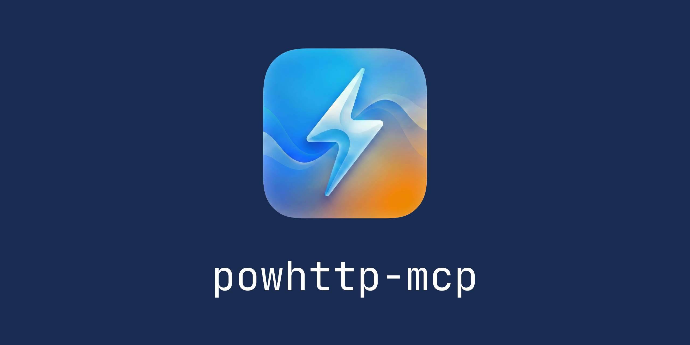

# powhttp-mcp

<p align="center">
  
</p>

<p align="center">
  <a href="https://pkg.go.dev/github.com/usestring/powhttp-mcp"></a>
  <a href="https://github.com/usestring/powhttp-mcp/releases"></a>
  <a href="LICENSE"></a>
</p>

<p align="center">
  An MCP server that gives AI assistants X-ray vision into HTTP traffic captured by <a href="https://powhttp.com">powhttp</a>.
</p>

---

## See it in action

Using `/generate_scraper` to build a BMW car listing monitor:

https://github.com/user-attachments/assets/be098e9d-d700-491c-ae7f-5afb12732728

---

## Features

- **HTTP Traffic Analysis** - Search, inspect, and analyze captured HTTP requests/responses
- **Anti-Bot Detection** - Compare browser vs program traffic to identify detection vectors
- **Fingerprinting** - Generate TLS (JA3/JA4) and HTTP/2 fingerprints
- **API Mapping** - Cluster and catalog API endpoints from captured traffic
- **Flow Tracing** - Trace related requests (redirects, dependent calls)
- **Schema Validation** - Validate response bodies against Go structs, Zod, or JSON Schema
- **Scraper Generation** - Generate PoC Go scrapers from captured traffic

Schema validation in action - correcting data structures for edge cases:

https://github.com/user-attachments/assets/1156c537-70ab-4179-ad4a-c148988ac503

---

## Installation

Install via `go install`:

```bash
go install github.com/usestring/powhttp-mcp/cmd/powhttp-mcp@latest
```

Or install a specific version:

```bash
go install github.com/usestring/powhttp-mcp/cmd/powhttp-mcp@v1.0.0
```

---

## Usage

### Connecting to Cursor

Add to your `.cursor/mcp.json`:

```json
{
  "mcpServers": {
    "powhttp": {
      "command": "powhttp-mcp",
      "env": {
        "POWHTTP_BASE_URL": "http://localhost:7777"
      }
    }
  }
}
```

### Connecting to Claude Desktop

Add to your Claude Desktop config (`~/Library/Application Support/Claude/claude_desktop_config.json` on macOS):

```json
{
  "mcpServers": {
    "powhttp": {
      "command": "powhttp-mcp",
      "env": {
        "POWHTTP_BASE_URL": "http://localhost:7777"
      }
    }
  }
}
```

The generated scraper running successfully:

https://github.com/user-attachments/assets/52b30cbf-7c66-40b1-a3fe-9c12d37ece11

---

## MCP Tools

powhttp-mcp provides 12 tools for HTTP traffic analysis:

| Tool | Description |
|------|-------------|
| `powhttp_sessions_list` | List all sessions with entry counts |
| `powhttp_session_active` | Get the currently active session |
| `powhttp_search_entries` | Search entries with filters and free text |
| `powhttp_get_entry` | Get full details of a specific entry |
| `powhttp_get_tls` | Get TLS handshake events for a connection |
| `powhttp_get_http2_stream` | Get HTTP/2 frame details for a stream |
| `powhttp_fingerprint` | Generate HTTP, TLS, and HTTP/2 fingerprints |
| `powhttp_diff_entries` | Compare two entries to find detection differences |
| `powhttp_extract_endpoints` | Cluster entries into endpoint groups |
| `powhttp_describe_endpoint` | Generate detailed endpoint description |
| `powhttp_trace_flow` | Trace related requests around a seed entry |
| `powhttp_validate_schema` | Validate entry bodies against a schema |

See [internal/mcp/README.md](internal/mcp/README.md) for detailed tool documentation.

---

## Environment Variables

<details>
<summary><strong>Basic Configuration</strong></summary>

| Variable | Description | Default |
|----------|-------------|---------|
| `POWHTTP_BASE_URL` | Where to find the powhttp API server | `http://localhost:7777` |
| `POWHTTP_PROXY_URL` | Proxy URL used by prompts when generating scrapers and debugging | `http://127.0.0.1:8890` |
| `LOG_LEVEL` | How verbose the logs are: `debug`, `info`, `warn`, `error` | `info` |
| `LOG_FILE` | File to write logs to (empty = print to console) | `""` (console) |

</details>

<details>
<summary><strong>Performance Tuning</strong></summary>

| Variable | Description | Default |
|----------|-------------|---------|
| `HTTP_CLIENT_TIMEOUT_MS` | How long to wait for API responses (milliseconds) | `10000` (10s) |
| `FETCH_WORKERS` | How many entries to fetch in parallel | `16` |
| `ENTRY_CACHE_MAX_ITEMS` | How many entries to keep in memory cache | `512` |
| `REFRESH_INTERVAL_MS` | How often to check for new entries (milliseconds) | `2000` (2s) |
| `REFRESH_TIMEOUT_MS` | Max time for index refresh operation (milliseconds) | `15000` (15s) |
| `FRESHNESS_THRESHOLD_MS` | Consider data stale after this many milliseconds | `500` (0.5s) |

</details>

<details>
<summary><strong>Data Limits</strong></summary>

| Variable | Description | Default |
|----------|-------------|---------|
| `TOOL_MAX_BYTES_DEFAULT` | Max response body size tools return (bytes) | `2000000` (2MB) |
| `RESOURCE_MAX_BODY_BYTES` | Max body size for MCP resources (bytes) | `65536` (64KB) |
| `TLS_MAX_EVENTS_DEFAULT` | Max TLS handshake events to return | `200` |
| `H2_MAX_EVENTS_DEFAULT` | Max HTTP/2 frames to return | `200` |
| `BOOTSTRAP_TAIL_LIMIT` | Max entries to load when starting up | `20000` |

</details>

<details>
<summary><strong>Log Rotation</strong></summary>

| Variable | Description | Default |
|----------|-------------|---------|
| `LOG_MAX_SIZE_MB` | Rotate log when it reaches this size (MB) | `10` |
| `LOG_MAX_BACKUPS` | Keep this many old log files | `5` |
| `LOG_MAX_AGE_DAYS` | Delete log files older than this (days) | `28` |
| `LOG_COMPRESS` | Compress old log files (`true`/`false`) | `true` |

</details>

---

## Development

### Prerequisites

- Go 1.24.5 or later
- Running powhttp instance

### Building

```bash
go build ./cmd/powhttp-mcp
```

### Testing

```bash
go test ./...
```

---

## Contributing

We use **squash merges** for all pull requests. When creating a PR, ensure the **PR title** follows [Conventional Commits](https://www.conventionalcommits.org/) format, as it will become the commit message:

**Triggers release:**
- `feat:` - minor version bump
- `fix:` - patch version bump
- `perf:` - patch version bump
- `revert:` - patch version bump
- `feat!:` or `BREAKING CHANGE:` - major version bump

**No release:**
- `docs:`, `chore:`, `refactor:`, `test:`, `style:`, `build:`, `ci:`

Versioning is automated via [release-please](https://github.com/googleapis/release-please).

---

## License

This project is licensed under the GNU Affero General Public License v3.0 - see the [LICENSE](LICENSE) file for details.

---

## Related Projects

- [powhttp](https://powhttp.com) - HTTP traffic capture and analysis
- [Model Context Protocol](https://modelcontextprotocol.io/) - Protocol specification
